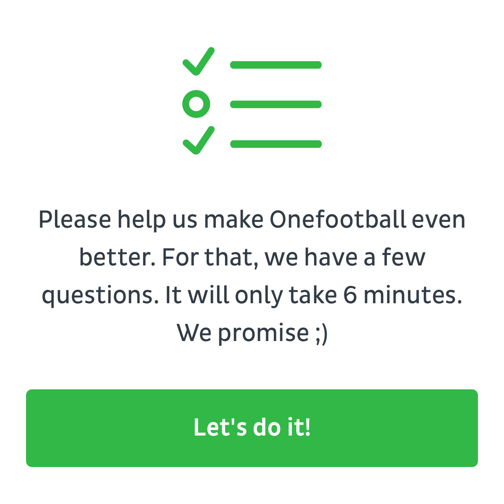

# Airship HTML template #
**Contributors:**      @dominikdotsat  
**Ticket:**			   https://onefootball.atlassian.net/browse/US-473 

**Tags:**  
**License:**           GPLv2  
**License URI:**       http://www.gnu.org/licenses/gpl-2.0.html  


## DESCRIPTION ##

The User research team relies on Airship’s In-App messages structure to reach Onefootball users and ask them to take part to quantitative researches. 

## LIMITATION ##

Current setup do not permit the User research team to pass certain user information such as the DEVICE ID from SurveMoney through in-app message setup. 

## SOLUTION ##

Using Costum HTML option to pass variables and design the in-app message including: button message, visual, surveymonkey link to survey. 

## TASK ##

* define elements that form the in app message
* create HTML template that passes DEVICE ID 

Please keep in mind this is a *proof of concept* as this will be functional to enrich our data WH and future DMP. Therefore i set priority to minor as this should not be a blocker for your epics. 

## HACKING ##

In the `button-survey.html` file replace the `surverUrl` variable's value with the survey url:
```javascript
var surverUrl = "https://www.surveymonkey.de/r/airshipproofofconcept"; 
```

In the `body`replace the texts, and image with the desired content:
```html
<body>
	
	<p id="mainText" data-ua-text="main-text">
		Please help us make Onefootball even better. For that, we have a few questions. It will only take 6 minutes. <br> We promise ;) THX!
	</p>
	<button id="surveyButton" data-ua-text="survey-button" disabled>Let’s do it now!</button>
</body>
```

## MORE ##
* https://docs.airship.com/reference/custom-templates/
* https://docs.airship.com/tutorials/orchestration/in-app-automation/in-app-automation/
* https://go.urbanairship.com/

## IMAGES ##




## CHANGELOG ##

### 0.0.1 ###
* First release
